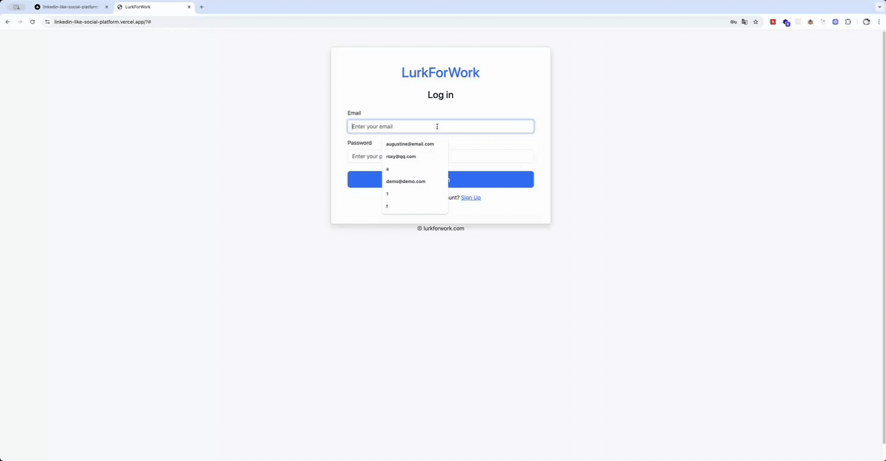
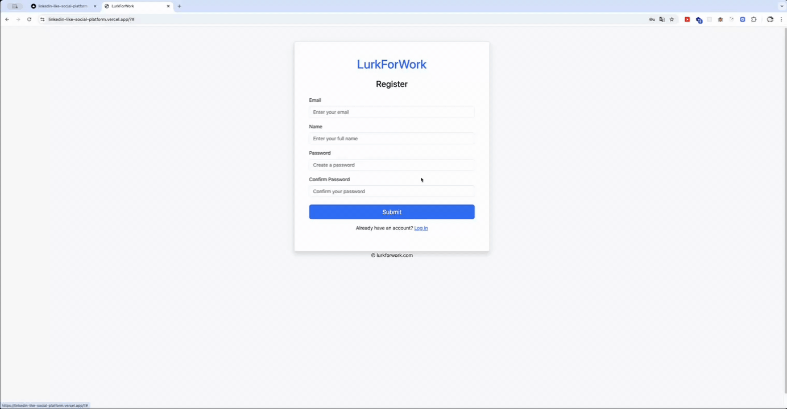
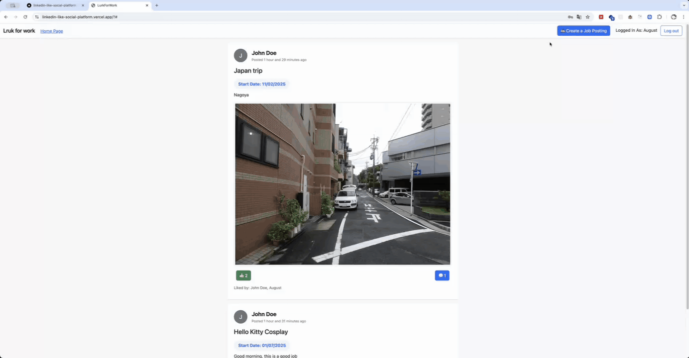
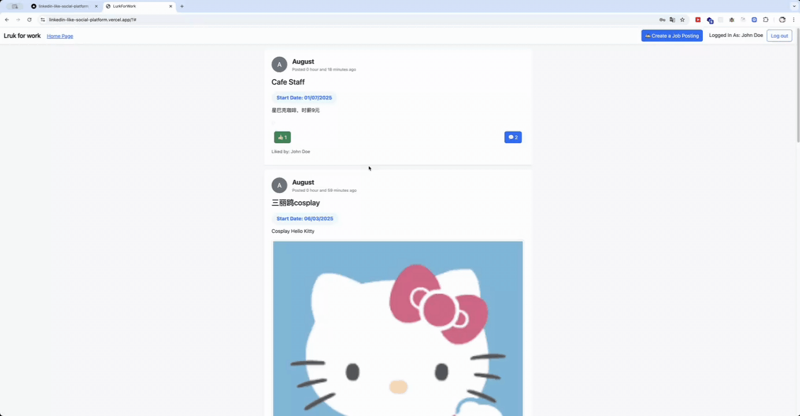
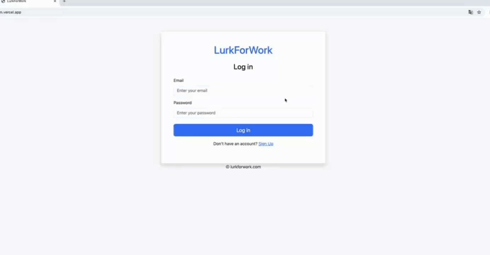

# LurkForWork - LinkedIn 类社交平台

一个现代化的类似 LinkedIn 的社交网络平台，专注于职业社交和工作机会分享。

## 📝 项目简介

LurkForWork 是一个功能完整的社交平台，允许用户发布工作机会、进行社交互动、建立职业联系。该项目使用 Vanilla Javascript 构建，通过利用 Bootstrap 框架提供流畅的用户体验和响应式设计。

## 项目部署

前端部署在 vercel, 后端用 railway 部署

## ✨ 主要功能

### 🔐 用户认证系统

- 用户注册与登录
- 安全的身份验证
- 密码验证和错误处理

### 💼 工作岗位管理

- 发布新的工作机会
- 浏览所有工作岗位
- 编辑和管理个人发布的岗位
- 支持图片上传

### 💬 社交互动

- 点赞工作岗位
- 评论和回复
- 实时互动反馈

### 👤 用户资料

- 个人资料页面
- 用户关注功能
- 个人工作岗位展示

### 🔄 现代化体验

- 无限滚动加载（lazy-loading 一次只加载 5 个 post）
- 响应式设计
- 实时更新

## 🎬 功能演示

### 正常登录流程



展示用户正常的登录操作流程，包括输入凭据和成功登录后的界面跳转。

### 注册密码验证



演示注册过程中的密码验证功能，当两次输入的密码不匹配时的错误提示。

### 创建新工作岗位



展示如何发布新的工作机会，包括填写岗位信息、上传图片等完整流程。

### 评论和点赞功能



演示用户如何对工作岗位进行点赞和评论，实现社交互动功能。

### 错误处理



通过 Error Popup 显示具体错误。

## 🛠️ 技术栈

> 前端由我撰写，后端由教学团队提供

- **前端**: HTML5, CSS3, JavaScript (ES6+)
- **样式框架**: Bootstrap 5.3.3
- **后端 API**: RESTful API 集成
- **数据库**: JSON 文件

## 📁 项目结构

```
LinkedIn-like-social-platform/
├── frontend/
│   ├── index.html          # 主页面
│   ├── src/
│   │   ├── main.js         # 主要应用逻辑
│   │   ├── config.js       # 配置文件
│   │   └── helpers.js      # 工具函数
│   └── styles/
│       └── global.css      # 全局样式
├── gifs/                   # 功能演示动图
├── util/                   # 工具脚本
└── README.md              # 项目说明文档
```

## 🚀 快速开始

### 使用说明

1. **注册账户**

   - 访问注册页面
   - 填写个人信息
   - 确保两次输入的密码一致

2. **登录系统**

   - 使用注册的凭据登录
   - 系统会通过判断 localStorage 中是否存在 token 来判断登录状态，而非使用 cookies

3. **发布工作岗位**

   - 点击"创建新岗位"按钮
   - 填写岗位标题、描述和开始日期
   - 可选择上传相关图片

4. **社交互动**

   - 浏览其他用户发布的岗位
   - 点赞感兴趣的工作机会
   - 在评论区与发布者或其他用户交流

5. **个人资料**
   - 查看和编辑个人资料
   - 管理已发布的工作岗位
   - 关注其他用户
